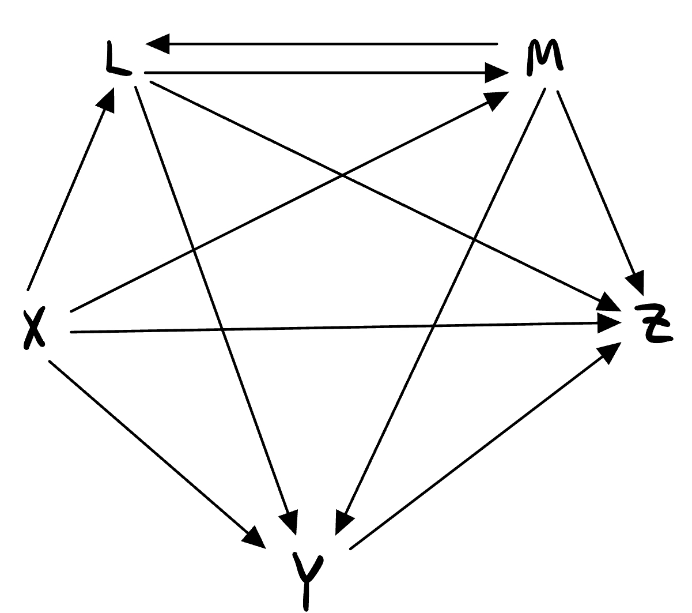

# Mini Project #1 #

**Properties**

- A) We say that a set $X$ of real numbers has property A if:   $\forall x\in\mathbb{X}, \exists y\in\mathbb{X} : y > x$
- B) We say that a set $X$ of real numbers has property B if:   $\forall x\in\mathbb{N}, \exists y\in\mathbb{X} : y > x$
- C) We say that a set $X$ fo real numbers has property C if:   $\exists y\in\mathbb{N}, \forall x\in\mathbb{X} : y \leq x$

## Set 1: The set of integers $\mathbb{Z}$ ##

### Property A ### 
For property A we have to find $\forall x\in\mathbb{Z}, \exists y\in\mathbb{Z} : y > x$.  Since we have the set $\mathbb{Z}$, we have an infinite amount of positive and negative integers. This means that we have infinitely big and small numbers. 
Therefore, for any integer $x$ there exists an integer $y$ such that $y > x$. For example, if we have a value $x = 100$ then we also have the value $y = x + 1$. This means that 
$y = 101$ which satisfies the inequality of Property A: $101 > 100$. This idea follows for any integer $x$ because we have a set of infinte integers and there will always exist an
integer $y = x + 1$ no matter how big or small $x$ is and that integer $y$ will always be bigger than $x$. Thus, the set $\mathbb{Z}$ satisfies property A.

### Property B ###
For property B we have to find $\forall x\in\mathbb{N}, \exists y\in\mathbb{Z} : y > x$.  In this property we are looking for an $x$ in the set $\mathbb{N}$ which is the set of all positive integers $\{1, 2, 3,...\}$. In this case we have an infinite number of positive integers to choose for our variable $x$. In our set $\mathbb{Z}$ we also have an infinite number of positive integers. Knowing these two sets we can follow a similar logic to property A. For any $x \in\mathbb{N}$ we also have an integer $y = x + 1$. Since, we know that $x$ is a positive integer, then we also know that $x + 1$ is a positive integer. Since, $x + 1 > x$ and we know $y = x + 1 \in\mathbb{Z}$ then we can conclude that the set $\mathbb{Z}$ satisfies property B.

### Property C ###
For property C we have to find $\exists y\in\mathbb{N}, \forall x\in\mathbb{Z} : y \leq x$.  
Since we have the set $\mathbb{N}$ which is the set of all positive integers $\{1, 2, 3,...\}$, then this means that $\forall y\in\mathbb{N}$, $y > 0$. We also have the set $\mathbb{Z}$. Since $\mathbb{Z}$ is the set of all positive and negative integers then this means that this set contains negative integers. Having negative integers shows that $\exists x\in\mathbb{Z}: x < 0$ Since, there exists an $x \in\mathbb{Z}: x < 0$ then there cannot exist $y\in\mathbb{N} : y \leq x$. This is because $y \in\mathbb{N}$ is all positive integers and $x\in\mathbb{Z}$ contains negative integers and a positive integer cannot be less than a negative integer. Thus, we can conclude that the set $\mathbb{Z}$ does not satisfy property C since there does not exist a natural number $y$ that is less than or equal to all integers $x$.

## Set 2: The set of natural numbers $\mathbb{N}$(all positive integers) ##
### Property A ###
For property A we have to find $\forall x\in\mathbb{N}, \exists y\in\mathbb{N} : y > x$.   
Since we have the set $\mathbb{N}$ for both $x$ and $y$ then we are looking at the set of of all positive integers: $\{1, 2, 3, ...\}$. Since this set provides us with an infinite amount of natural numbers, we know that if we have a natural number $x$ then we also have a natural number $x + 1$. Since these are both in the set $\mathbb{N}$ we can set $y = x + 1$. Thus, $y, x \in\mathbb{N}$ and it is clear that $x + 1 > x$. For example, if $x = 10$ we know that $y = 10 + 1$ exists and $11 > 10$. Therefore, we can conclude that for every $x \in\mathbb{N}$ there exists a $y \in\mathbb{N}$ such that $y > x$.

### Property B ###
For property B we have to find $\forall x\in\mathbb{N}, \exists y\in\mathbb{N} : y > x$.  
As we can see from property A, the statements for property A and B are exactly the same for the set $\mathbb{N}$ and therefore follow the same steps for proving them. Thus, by property A, we can conclude that the set $\mathbb{N}$ satisfies property B.

### Property C ###
For property C we have to find $\exists y\in\mathbb{N}, \forall x\in\mathbb{N} : y \leq x$.  
Since we have the set $\mathbb{N}$ for both $x$ and $y$. This means that we have infinite amount of positive integers, i.e. $\{1, 2, 3, ...\}$. In order to show that this property is satisfied we can set $y = 1$ since $1 \in\mathbb{N}$ and is smallest possible number in the set. Since $1$ is the smallest possible number for $y$ and $x$ in the set $\mathbb{N}$ we can see that if we also set $x = 1$ then the inequality $(y \leq x) = (1 \leq 1)$ will always be true since $x$ can only get bigger and not smaller. Thus we can conclude that there does exist $y\in\mathbb{N}$, which is $1$, such that $\forall x\in\mathbb{N} : y \leq x$. 
 
 
**Mini Project Done**

---
# Mini Project #5 #
## Part 1: ##
**Prove using mathematical induction that:**  
$$1^2 + 2^2 + ... + n^2 = \frac{n(n + 1)(2n + 1)}{6}$$
**Base Case:** For the base case $n = 1$ we get:  
$$1^2 = \frac{1(1 + 1)(2(1)+1)}{6},$$
$$1 = \frac{(2)(3)}{6},$$
$$1 = \frac{6}{6} = 1,$$
Thus, we can see that the base case $n = 1$ is true.   
**Inductive Step:**  
Since the statement is true for the base case $n = 1$, we can assume that the statement is also true for $k \geq 1$. This will then give us the inductive hypothesis:  
$$1^2 + 2^2 + ... + k^2 = \frac{k(k + 1)(2k + 1)}{6}$$
Since we assumed that the statement holds for $k \geq 1$ we have to prove that it also holds for $k + 1$. So we need to show that:
$$1^2 + 2^2 + ... + k^2 + (k + 1)^2 = \frac{(k+1)((k+1) + 1)(2(k+1) + 1)}{6} (eq.1)$$
We want to prove that both sides of this equation are equal. By the inductive hypothesis we know that: 
$$1^2 + 2^2+...+ k^2 = \frac{k(k+1)(2k+1)}{6}$$
So we have that the left side of the equation is:
$$1^2 + 2^2 + ... + k^2 + (k + 1)^2 = \frac{k(k+1)(2k+1)}{6} + (k+1)^2$$
Then we can combine the terms in order to get:
$$\frac{k(k+1)(2k+1)}{6} + \frac{6(k+1)^2}{6},$$
$$= \frac{k(k+1)(2k+1) + 6(k+1)^2}{6}$$
Then we can factor out $(k+1)$ in order to obtain:
$$=\frac{(k+1)[k(2k+1) +6(k+1)]}{6}$$
Then we can combine more like terms and get:
$$= \frac{(k+1)[2k^2 + k + 6k + 1]}{6},$$
$$= \frac{(k+1)(2k^2 + 7k + 1)}{6}$$
We can see that,
$$2k^2 + 7k + 1 = (2k + 3)(k + 2),$$
And thus, we get the fraction:
$$\frac{(k+1)(2k+3)(k+2)}{6}$$
After factoring we also see that:
$$2k + 3 = 2(k+1) + 1,$$
and,
$$k + 2 = (k + 1) + 1,$$
Then we can plug these into the fraction and get:
$$=\frac{(k+1)((k+1)+1)(2(k+1)+1)}{6}$$

Now we have proved that the left handside of (eq. 1) is equal to the right handside and therefore, by mathematical induction
$$1^2 + 2^2 + ... +n^2 = \frac{n(n+1)(2n+1)}{6}$$
holds true. Thus, concluding the proof.

## Part 2: ##
**Expression:**
$$(n+1)^4 - n^4 = 4n^3 + 6n^2 + 4n + 1$$
For n = 0:
$$(0+1)^4 - 0^4 = 4(0)^3 + 6(0)^2 + 4(0) + 1$$
$$= 1^4 - 0 = 0 + 0 + 0 +1$$
$$= 1 = 1$$
For n = 1:
$$(1+1)^4 - 1^4 = 4(1)^3 + 6(1)^2 + 4(1) + 1$$
$$= 2^4 - 1^4 = 4^3 + 6^2 + 4 + 1$$
$$= 16 - 1 = 4 + 6 + 4 + 1$$
$$= 15 = 15$$
For n = 2:
$$(2+1)^4 - 2^4 = 4(2)^3 + 6(2)^2 + 4(2) + 1$$
$$= 3^4 - 2^4 = 32 + 24 + 8 + 1$$
$$= 81 - 16 = 32 + 24 + 8 + 1$$
$$= 65 = 65$$
For n = 3:
$$(3+1)^4 - 3^4 = 4(3)^3 + 6(3)^2 + 4(3) + 1$$
$$= 4^4 - 81 = 4(27) + 54 + 12 + 1$$
$$= 256 - 81 = 108 +54 + 12 + 1$$
$$= 175 = 175$$
For n = 4:
$$(4+1)^4 - 4^4 = 4(4)^3 + 6(4)^2 + 4(4) + 1$$
$$= 5^4 - 256 = 4(64) + 16(6) + 16 + 1$$
$$= 625 - 256 = 256 + 96 + 17$$
$$= 369 = 369$$
When we add them all up we should get: $$1 + 15 + 65 + 175 + 369 = 625$$

Now for adding up the equations we get the following on the left handside:
$$(1^4 - 0^4) + (2^4 - 1^4) + (3^4 - 2^4) + (4^4 - 3^4) + (5^4 - 4^4)$$
We can see that a lot of the terms cancel out and we are left with:
$$5^4 - 0^4 = 5^4 = 625$$
When we add the equations we will get the following on the right handside:
$$(4(0)^3 + 6(0)^2 + 4(0) + 1) + (4(1)^3 + 6(1)^2 + 4(1) + 1) + (4(2)^3 + 6(2)^2 + 4(2) + 1) + (4(3)^3 + 6(3)^2 + 4(3) + 1) + (4(4)^3 + 6(4)^2 + 4(4) + 1)$$
$$= 4(0^3 + 1^3 + 2^3 + 3^3 +4^3) + 6(0^2 + 1^2 + 2^2 + 3^2 + 4^2) + 4(0 + 1 + 2 + 3 + 4)+ 1(5)$$
We can see that the values within the first set of parantheses follow the sum of cubes which is:
$$1^3 + 2^3 + \cdots + n^3 = \frac{n^2(n+1)^2}{4}$$
Since the summation goes up to $n = 4$ we see that the values within the parantheses sum up to:
$$\frac{4^2(4+1)^2}{4} = 100$$
It can also be seen that the second set of parantheses has the values that follow the sum of squares which is:
$$1^2 + 2^2 + \cdots + n^2 = \frac{n(n+1)(2n+1)}{6}$$
Since the summation goes up to $n = 4$ the values in the second set of parantheses sum up to:
$$\frac{4(4+1)(2(4)+1)}{6} = 30$$
Similarly, the third set of parentheses is just the sum of the natural numbers which is:
$$1 + 2 +\cdots+ n = \frac{n(n+1)}{2}$$
Since the summation goes up to $n = 4$ we have:
$$\frac{4(4+1)}{2} = 10$$
Thus, we end up with the equation:
$$4(100) + 6(30) + 4(10) + 5 = 625$$

## Part 3: ##
From **Part 2** we can see that when we sum up the equations from $n = 0$ to  $n$ times it follows the pattern of:
$$1^4 - 0^4 + 2^4 - 1^4 + \cdots + n^4 - (n-1)^4 = 4(0^3 + 1^3 + 2^3 + \cdots + (n-1)^3) + 6(0^2 + 1^2 + \cdots+ (n-1)^2) + 4(0 + 1 +\cdots+(n-1)) + n*1$$
Also from **Part 2** we see that this equation equals $n^4 - 0^4$ on the left handside.
Similarly to **Part 2**, the right handside of the equation has the sum of powers contained within the parantheses. Thus, we will have the following when plugging in $n-1$ into the respective equations of the sum of powers that we used in with the respective values in the parantheses in **part 2**.
$$\frac{(n-1)^2(n-1+1)^2}{4} = \frac{(n-1)^2(n)^2}{4}$$
However, since we are summing to $n$ we want to add $1$ to $n-1$ so it becomes just $n$. This will then give us:
$$\frac{(n)^2(n+1)^2}{4}$$
This is the derivation of equation (5.3) from the project write-up.

## Part 4: ##

# Mini Project #6 ##
## GRAPH 1: ##

